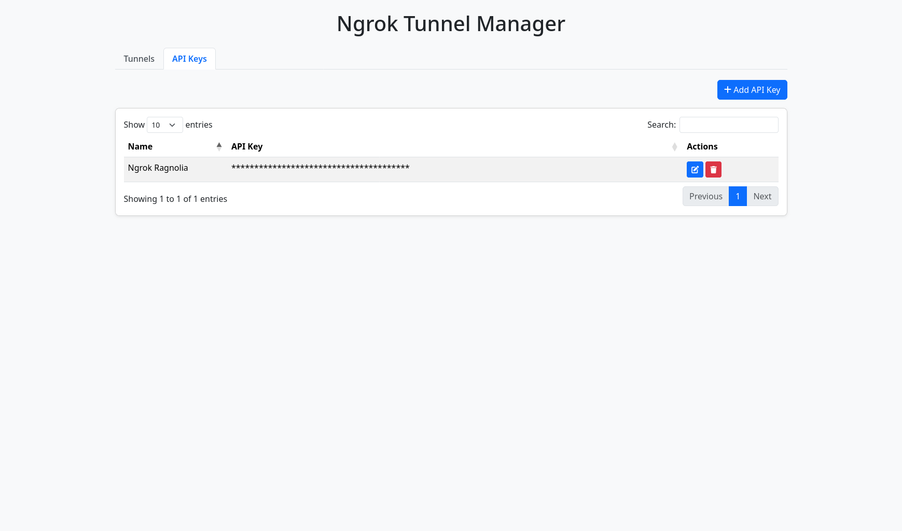

# Ngrok Tunnel Manager 🌐✨

[](https://www.python.org/downloads/release/python-3120/)
[](https://flask.palletsprojects.com/)
[](LICENSE)
[](CONTRIBUTING.md)

Manage your Ngrok tunnels like a pro! 💻 A simple yet powerful web interface to organize and monitor your Ngrok tunnels.

# Screenshots
 
 

## ✨ Features
- 🚀 Easy tunnel management interface
- 📊 Real-time tunnel status monitoring
- 📁 SQLite database support
- 🐳 Podman/Docker container ready

## 🚀 Getting Started

### 📋 Requirements
- Python 3.12
- Flask
- Pyngrok

### 🐳 Podman Installation
```bash
git clone https://github.com/semarainc/ngrok-tunnel-manager.git
cd ngrok-tunnel-manager
podman build . -t localhost/ngrokmanager
podman run -i -t -d --restart=always \
    --network=host \
    --replace \
    --name=ngrok-tunnel-manager \
    --volume $(pwd):/app \
    localhost/ngrokmanager

# Set up systemd service
mkdir -p ~/.config/systemd/user
podman generate systemd \
    --new \
    --name \
    --no-header \
    --restart-policy=on-failure \
    --container-prefix='' \
    --pod-prefix='' \
    --files \
    ngrok-tunnel-manager

loginctl enable-linger $USER
```

### 🖥️ Manual Installation
```bash
git clone https://github.com/semarainc/ngrok-tunnel-manager.git
cd ngrok-tunnel-manager

# Set up virtual environment
python3 -m venv env
source env/bin/activate
pip install -r requirements.txt

# Start application
python3 app.py
```

## 📖 Usage
After installation, access the web interface at:
`http://localhost:4141`

- Add new tunnels with simple forms
- Monitor active tunnel status
- Manage configurations through intuitive UI
- View detailed tunnel statistics

## 🤝 Contribution
We ❤️ contributions! Feel free to:
```bash
1. Fork the project (https://github.com/semarainc/ngrok-tunnel-manager/fork)
2. Create your feature branch (git checkout -b feature/AmazingFeature)
3. Commit your changes (git commit -m 'Add some AmazingFeature')
4. Push to the branch (git push origin feature/AmazingFeature)
5. Open a Pull Request
```

## 📜 License
Distributed under the MIT License. See `LICENSE` for more information.

---

⭐ **Star us on GitHub** if you find this project useful! ⭐

> "Simplify your tunnel management today!" 🚇💨
